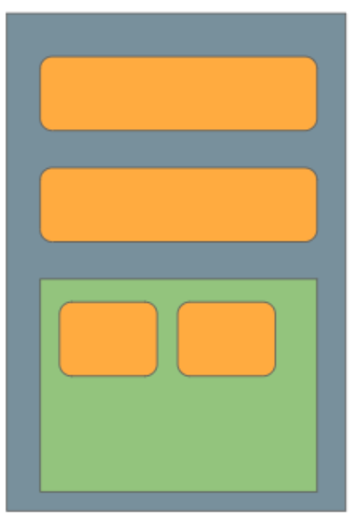

//caminho padrão para imagens

:figure-caption: Figura
:doctype: book

//gera apresentacao
//pode se baixar os arquivos e add no diretório
:revealjsdir: https://cdnjs.cloudflare.com/ajax/libs/reveal.js/3.8.0

//GERAR ARQUIVOS
//make slides
//make ebook

== Classe Context

Trata-se de uma classe abstrata. Através dela seu app tem acesso aos recursos de layouts, imagens, strings, SharedPreferences, banco de dados, Services, BroadcastReceiver, etc.
Alguns tipos de contexto: 
- ApplicationContext: representa o contexto global do app, escopo de vida a nível de app;
- ActivityContext: associado a uma atividade específica, escopo de vida a nível de atividade, usado para acessar recursos específicos da atividade como views, exibir caixas de diálogo.

Application (classe base para manter o estado global do app) é um Context;
Activity é um Context;
Service é um Context.

- Referência: STACK OVER FLOW. O que é um context no Android. Disponível em: https://pt.stackoverflow.com/questions/38853/o-que-%C3%A9-um-context-no-android. Pergunta realizada pelo usuário <https://pt.stackoverflow.com/users/6699/felipe-rce> e respondida pelo usuário <https://pt.stackoverflow.com/users/357/piovezan>. 

= Linear Layout

O layout pode ser visto como um container, pois nele vão estar as views como um botão, um campo de entrada de texto, uma imagem e outras views. Existem vários tipos de layout que o SDK oferece que serão vistos em outros exemplos. O Linear Layout é o mais simples dos layouts, nele pode ser configurado dois tipos de orientações. Qual a diferença entre o Linear Layout com orientação vertical e com orientação horizontal?

A figura 1 mostra as posições dos elementos quando usa-se o linear layout com orientação verticial.

Figura 1

image::linear_vertical.png[width=100,height=100]

A figura 2 mostra as posições dos elementos quando usa-se o linear layout com orientação horizontal.

Figura 2

image::linear_horizontal.png[width=100,height=100]

A figura 3 mostra um exemplo de combinação de layouts. Observe que foi possível inserir um linear layout com orientação horizontal, dentro de um linear layout com orientação vertical.

Figura 

- Exemplos práticos (linear layout, view, activity e intent)

- link:codigos/MainActivity.java[MainActivity]
- link:codigos/activity_main.xml[activity_main]
- link:codigos/SegundaActivity.java[SegundaActivity]
- link:codigos/activity_segunda.xml[activity_segunda]

A ferramenta Color Tool fornece uma paleta de cores possibilitando uma visualização das combinações das cores. A ferramenta ajuda no design do aplicativo, segue o link para acesso: https://m2.material.io/resources/color/#!/. Acesso em: 03 fev. 2023

Para criar as várias versões de resolução de imagem necessárias para o aplicativo podemos usar várias ferramentas. A ferramenta App Icon Generator pode servir para essa finalidade. A ferramenta oferece três opções, das quais duas são relevantes para o desenvolvimento de aplicativos Android. As duas opções são:

 - AppIcon: usada para criar ícones / formatação das imagens que serão usadas no aplicativo. A ferramenta esta disponível no seguinte endereço: https://appicon.co/. Acesso em: 03 fev. 2023
  
Outra ferramenta que também pode ser usada para criação de ícones é criada por ROMAN NURIK chamada Android Asset Studio. Disponível em: http://assetstudio.androidpro.com.br/. Acesso em: 03 fev. 2023;

Depois de criar as várias versões da imagem, use o recurso Resource Manager no Android Studio para adicionar as imagens.

Para saber mais detalhes sobre os estilos e tamanhos referentes ao texto, acesse o material disponibilizado pela Google, Material Design. Disponível em: https://material.io/develop/android/theming/typography.

