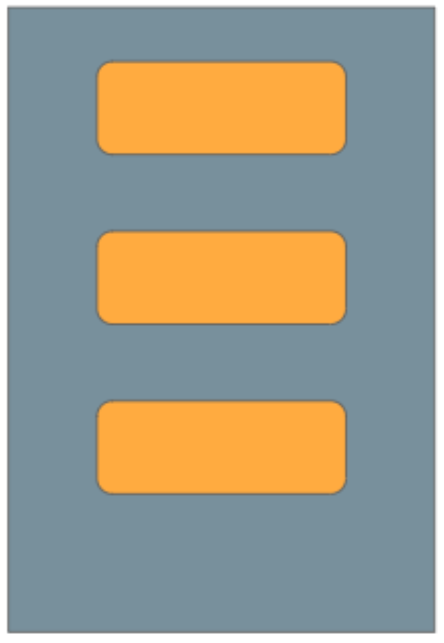

//caminho padrão para imagens

:figure-caption: Figura
:doctype: book

//gera apresentacao
//pode se baixar os arquivos e add no diretório
:revealjsdir: https://cdnjs.cloudflare.com/ajax/libs/reveal.js/3.8.0

//GERAR ARQUIVOS
//make slides
//make ebook

= Linear Layout

O layout pode ser visto como um container, pois nele vão estar as views como um botão, um campo de entrada de texto, uma imagem e outras views. Existem vários tipos de layout que o SDK oferece que serão vistos em outros exemplos. O Linear Layout é o mais simples dos layouts, nele pode ser configurado dois tipos de orientações. Qual a diferença entre o Linear Layout com orientação vertical e com orientação horizontal?

A figura 1 mostra as posições dos elementos quando usa-se o linear layout com orientação verticial.

Figura 1

A figura 2 mostra as posições dos elementos quando usa-se o linear layout com orientação horizontal.

image::linear_horizontal.png[width=50,height=50]
