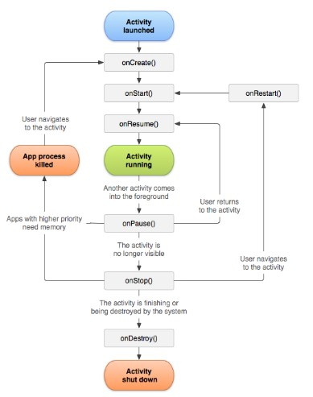

//caminho padrão para imagens
:imagesdir: images
:figure-caption: Figura
:doctype: book

//gera apresentacao
//pode se baixar os arquivos e add no diretório
:revealjsdir: https://cdnjs.cloudflare.com/ajax/libs/reveal.js/3.8.0

//GERAR ARQUIVOS
//make slides
//make ebook
== Introdução ao Desenvolvimento Mobile com Java, Kotlin e React Native

Este guia apresenta os primeiros passos para o desenvolvimento mobile utilizando três tecnologias populares: Java, Kotlin e React Native.
Abordaremos a instalação do ambiente, estrutura básica de um projeto e o ciclo de vida de uma Activity no Android.

**Público Alvo:** Iniciantes em desenvolvimento mobile.

=== Por que desenvolver para mobile?

O uso de smartphones e tablets tem crescido exponencialmente, tornando o desenvolvimento mobile uma área promissora e com alta demanda.
Aplicativos móveis permitem alcançar um público vasto, oferecendo soluções inovadoras para diversas necessidades.

=== Linguagens e Frameworks:

* **Java:** Linguagem robusta e popular, amplamente utilizada no desenvolvimento Android.
Possui uma vasta comunidade e recursos online.

=== Ambiente de Desenvolvimento:

* **Android Studio:** IDE oficial para desenvolvimento Android, gratuita e disponível para Windows, macOS e Linux.
Oferece ferramentas completas para desenvolvimento, incluindo emulador de dispositivos.

==== Instalação do Ambiente:

1. **Java Development Kit (JDK):** Necessário para compilar e executar código Java.
Faça o download e instalação do OpenJDK em: https://openjdk.java.net/install/
* **Configuração da variável de ambiente PATH:** Siga as instruções em: https://www.java.com/pt_BR/download/help/path.xml

2. **Android Studio:** Faça o download e instalação em: https://developer.android.com/studio/install?hl=pt-br
* **Novidades do Android Studio:** https://www.youtube.com/watch?v=bVt14IBv4NA&list=RDCMUCVHFbqXqoYvEWM1Ddxl0QDg&index=2

=== Criando seu Primeiro Projeto:

Após instalar o Android Studio, você pode criar um novo projeto e escolher entre Java ou Kotlin.

* **Java e Kotlin:**  O Android Studio oferece templates de projeto para iniciar rapidamente.

=== Estrutura de um Projeto Android:

* **Manifesto do Aplicativo (AndroidManifest.xml):** Contém informações essenciais sobre o aplicativo, como nome, ícone, permissões e componentes (Activities, Services, etc.).
* **Atividades (Activities):** Representam telas do aplicativo, permitindo interação com o usuário.
* **Layouts (XML):** Definem a interface gráfica do usuário, organizando elementos visuais na tela.
* **Código-fonte (Java/Kotlin):** Contém a lógica do aplicativo, controlando o comportamento dos componentes e respondendo a eventos.

=== Ciclo de Vida de uma Activity:

Uma Activity passa por diferentes estados durante sua execução.
Compreender esse ciclo é fundamental para criar aplicativos responsivos e eficientes.

**Principais métodos do ciclo de vida:**

* **onCreate()**: Chamado quando a Activity é criada.
Utilize este método para inicializar componentes e carregar layouts.
* **onStart()**: Chamado quando a Activity se torna visível para o usuário.
* **onResume()**: Chamado quando a Activity inicia ou retorna do estado pausado, estando pronta para receber interações do usuário.
* **onPause()**: Chamado quando a Activity perde o foco, deixando de estar em primeiro plano (ex: ao abrir outra aplicação).
* **onStop()**: Chamado quando a Activity deixa de ser visível (ex: ao minimizar o aplicativo).
* **onDestroy()**: Chamado antes da Activity ser destruída (ex: ao fechar o aplicativo).

=== Exemplo Prático (Olá Mundo):

**Java:**

[source]
----
package com.example.aula_base;

import static android.content.ContentValues.TAG;

import android.os.Bundle;
import android.util.Log;
import android.widget.TextView;
import android.widget.Toast;

import androidx.appcompat.app.AppCompatActivity;

public class MainActivity extends AppCompatActivity {

    @Override
    protected void onCreate(Bundle savedInstanceState) {
        super.onCreate(savedInstanceState);
        // Define o layout da activity
        setContentView(R.layout.activity_main);

        // Encontra o TextView no layout pelo ID e define seu texto
        TextView textoOlaMundo = findViewById(R.id.main);
        textoOlaMundo.setText("Olá, Mundo do @NOME@!");

        /**
  * Toast: Uma notificação visual rápida e simples.
  *
  * Um Toast é como um pequeno aviso que aparece na tela por um curto período,
  * geralmente na parte inferior. Ele é usado para fornecer feedback ao usuário
  * sobre uma ação ou evento no aplicativo, sem interromper a interação com a tela principal.
  *
  * Exemplos de uso:
  * - Confirmar ações: "Mensagem enviada com sucesso!"
  * - Mostrar informações breves: "Conectado ao Wi-Fi"
  * - Notificar sobre erros: "Falha no login"
  *
  * Características:
  * - Desaparece automaticamente após alguns segundos.
  * - Não exige interação do usuário.
  * - Exibe apenas texto simples.
  */
        Toast.makeText(this, "Criando", Toast.LENGTH_SHORT).show();
    }

    @Override
    protected void onStart() {
        super.onStart();
        // Exibe um Toast quando a Activity se torna visível
        Toast.makeText(this, "Iniciando", Toast.LENGTH_SHORT).show();
    }

    @Override
    protected void onResume() {
        super.onResume();
        // Exibe um Toast quando a Activity está em primeiro plano e pronta para interagir com o usuário
        Toast.makeText(this, "Usando", Toast.LENGTH_SHORT).show();
    }

    @Override
    protected void onPause() {
        super.onPause();
        // A Activity está perdendo o foco, mas ainda pode estar visível (ex: ao abrir um Dialog)
        Log.i(TAG, "onPause: Pausando");

        // O Toast pode não funcionar aqui de forma confiável, pois a Activity pode estar perdendo o contexto.
        // Utilize o Logcat para exibir mensagens de depuração nestes estados.
        // Você pode visualizar o Logcat no Android Studio em "Logcat" (geralmente na parte inferior da tela).
        Toast.makeText(this, "Pausando", Toast.LENGTH_SHORT).show();
    }

    @Override
    protected void onStop() {
        super.onStop();
        // A Activity não está mais visível (ex: ao minimizar o aplicativo)
        Log.i(TAG, "onStop: Parando");

        // Toast pode não funcionar aqui, utilize o Logcat para mensagens.
        Toast.makeText(this, "Parando", Toast.LENGTH_SHORT).show();
    }

    @Override
    protected void onDestroy() {
        super.onDestroy();
        // A Activity está sendo destruída (ex: ao fechar o aplicativo)
        Log.i(TAG, "onDestroy: Destruindo");

        // Toast pode não funcionar aqui, utilize o Logcat para mensagens.
        Toast.makeText(this, "Destruindo", Toast.LENGTH_SHORT).show();
    }
}
----

=== Próximos Passos:

* **Documentação Oficial:**
* **Java:** https://docs.oracle.com/javase/tutorial/
* **Kotlin:** https://kotlinlang.org/docs/home.html
* **Crie projetos simples:** Experimente criar aplicativos básicos para se familiarizar com cada linguagem.
* **Explore a documentação do Android:** https://developer.android.com/docs

Lembre-se, a prática é fundamental!
Continue explorando e construindo seus próprios projetos.
Boa sorte em sua jornada no desenvolvimento mobile!
